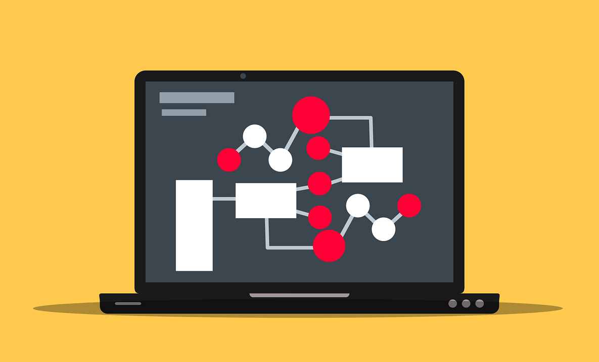

<h1>Algorítmica I - UPB</h1>

Este curso intensivo está diseñado específicamente para equipar a los estudiantes con las habilidades y conocimientos necesarios para destacarse en competencias de programación competitiva de alto nivel, especialmente en la International Collegiate Programming Contest (ICPC) Bolivia. A través de este curso, los estudiantes se sumergirán en una rigurosa práctica semanal de problemas algorítmicos que reflejan la complejidad y el estilo de aquellos presentados en la ICPC, así como en entrevistas técnicas de empresas líderes en tecnología, como Amazon y Google.

Con un fuerte énfasis en las estructuras de datos avanzadas, los algoritmos complejos y las técnicas de programación eficiente, este curso no solo prepara a los estudiantes para competir a nivel nacional en la ICPC Bolivia, sino que también los equipa con habilidades prácticas valoradas en la industria tecnológica. Al resolver desafiantes problemas de programación competitiva, los estudiantes afinarán su ingenio, mejorarán sus habilidades de programación y desarrollarán un profundo entendimiento de cómo aplicar teorías algorítmicas en escenarios del mundo real.

> [!NOTE]
> Este curso es una excelente oportunidad para aquellos estudiantes que deseen mejorar sus habilidades de programación y competir en la ICPC Bolivia. Sin embargo, también es una valiosa experiencia para cualquier estudiante que busque fortalecer su base en algorítmica y estructuras de datos, independientemente de su interés en la competencia.

Al tratarse de un curso práctico, la mayoría de tu tiempo te la pasarás programando. No obstante, las habilidades que adquirirás acá van más allá que simplemente ganar competencias:

- Al finalizar este curso, habrás alcanzado un nivel superior en tu comprensión y aplicación de estructuras de datos y algoritmos. No solo repasarás y expandirás tus conocimientos previos, sino que también profundizarás en aspectos avanzados, preparándote para enfrentar desafíos de programación complejos con confianza y destreza.

- Te transformarás en un desarrollador más meticuloso y preciso, adoptando un enfoque proactivo hacia la optimización del código. Aprenderás a ser consciente de los límites de tiempo y memoria desde el inicio de tu proceso de codificación, dándole la misma importancia a los casos límite y excepcionales. Este cuidado y precisión te distinguirán como profesional en el campo de la programación.

- Dominarás las técnicas de depuración, pero más importante aún, desarrollarás una intuición para prevenir errores antes de que ocurran. Este curso te enseñará a identificar potenciales fuentes de bugs y a implementar prácticas de codificación que minimicen su aparición, una habilidad invaluable en el desarrollo de software.

- Tu capacidad para abordar problemas se verá profundamente enriquecida a través de la práctica de pensamiento creativo y solución de problemas. Te enfrentarás a retos que demandarán soluciones ingeniosas y fuera de lo común, afilando tu habilidad para concebir estrategias eficientes y efectivas bajo un conjunto de restricciones estrictas.

Las habilidades desarrolladas en este curso trascienden su aplicación inmediata, enriqueciendo tu desempeño académico en otros cursos dentro del currículo de Ingeniería de Sistemas Computacionales. Estas competencias son altamente valoradas por líderes de la industria del software, como Google, Facebook y Microsoft, reconociéndolas como cruciales para la innovación tecnológica y la resolución de problemas complejos. Además, estas habilidades no solo te abrirán puertas a oportunidades de empleo en empresas de prestigio, sino que también te proporcionarán una sólida base para una carrera profesional exitosa y en constante evolución en el campo de la tecnología.

